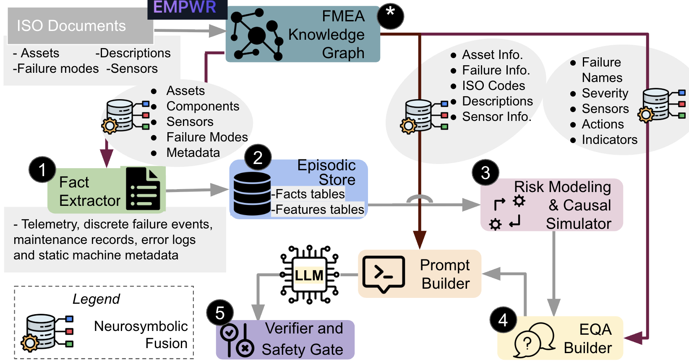
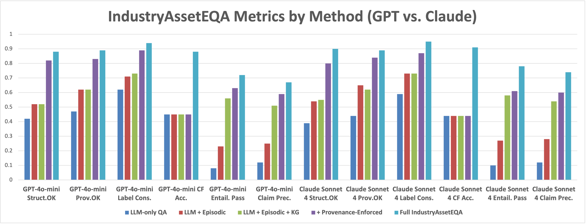
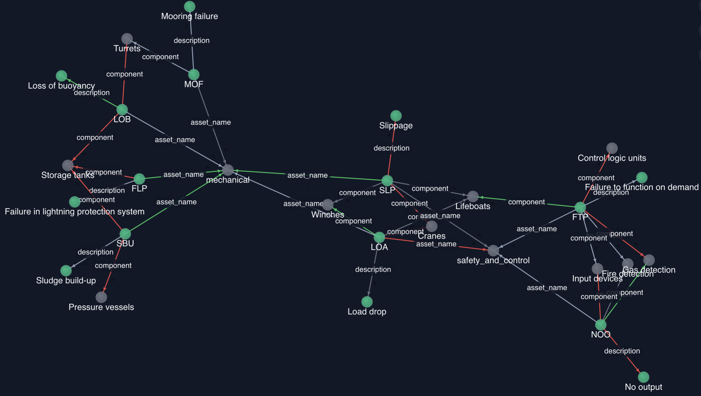

# IndustryAssetEQA

**Embodied Question Answering for Industrial Asset Maintenance**

This repository implements **IndustryAssetEQA** — a neurosymbolic embodied QA system that grounds answers in episode-level telemetry, an ISO-derived Failure Mode and Effects Analysis Knowledge Graph (FMEA-KG), and a causal risk simulator to support evidence-grounded, counterfactual, and action-oriented maintenance QA.

## IndustryAssetEQA: System Architecture and Key Results

<div align="center" style="display:flex; gap:12px; justify-content:center; align-items:flex-start; flex-wrap:wrap;">
  <figure style="margin:0; max-width:48%; min-width:280px;">
    <a href="assets/architecture.png" title="Open full-size architecture">
      
    </a>
    <figcaption style="text-align:center; font-size:0.9em; margin-top:6px;">Architecture diagram</figcaption>
  </figure>

  <figure style="margin:0; max-width:48%; min-width:280px;">
    <a href="assets/Picture1.png" title="Open full-size metrics">
      
    </a>
    <figcaption style="text-align:center; font-size:0.9em; margin-top:6px;">Key performance metrics</figcaption>
  </figure>
</div>

Compared to LLM-only baselines, IndustryAssetEQA substantially improves structural validity, provenance accuracy, counterfactual reasoning reliability, and reduces unsafe expert-rated overclaims.

The repository includes:

- Inference scripts for large language models  
- Episodic memory (SQLite-backed store)  
- FMEA knowledge graph resources  
- Counterfactual risk simulator  
- Evaluation and ablation pipelines  
- Structured episode datasets  

---
## FMEA Knowledge Graph (FMEA-KG)

IndustryAssetEQA ships an ISO-style Failure Mode & Effects Analysis Knowledge Graph (FMEA-KG) used for symbolic grounding, explanation enrichment, and label-normalization in QA prompts.

**What it is**  
The FMEA-KG is an asset-centric domain graph (constructed with the EMPWR workflow) that encodes asset classes, components, failure modes, sensor abstractions, and maintenance actions. It is used to (a) surface failure-mode metadata and typical indicators in prompts, (b) normalize diagnostic labels across datasets, and (c) verify recommended mitigation actions. 

**Key stats (released KG):**
- ~63 distinct failure modes mapped to 9 asset categories.  
- ~210 entities and ~1004 relationships (edges like `affects`, `component_of`, `indicated_by`, `mitigated_by`).  
These counts describe the domain-level graph used across all datasets (not dataset-specific). 

**What fields you’ll find on a failure-mode node**
- canonical failure code / display name  
- ISO metadata and human-readable description  
- associated sensors and typical indicators (e.g., `vibration_mean` above baseline)  
- recommended mitigation / maintenance actions and severity labels. 

**Where to get it**  
The FMEA-KG artifact (export used in our experiments) is released with the paper artifacts.

**Local layout (example)**  
We include the KG under `data/fmea_kg/` in Turtle and JSON-LD variants:


**Minimal Python example (rdflib)**
```python
from rdflib import Graph, URIRef

g = Graph()
g.parse("data/fmea_kg/fmea_kg.ttl", format="turtle")

# find failure modes that affect 'vibration' sensor (example)
q = """
PREFIX ex: <http://example.org/fmea#>
SELECT ?fm ?name WHERE {
  ?fm ex:associated_sensors ex:vibration .
  ?fm ex:display_name ?name .
}
LIMIT 50
"""
for row in g.query(q):
    print(row)
```

<figure align="center" style="max-width:900px; margin: 0 auto;">
  <a href="assets/KG.png">
    
  </a>
    <figcaption style="text-align:center; font-size:0.9em; margin-top:6px;">A snapshot of Failure Mode and Effects Analysis Knowledge Graph (FMEA-KG) showing sensor-asset-failure relationships</figcaption>

</figure>


## Quick Start (TL;DR)

1. Install dependencies (recommend a venv).
2. Set your model API credentials (`OPENAI_API_KEY`, `BASE_URL` if using non-default endpoints).
3. Run inference (example):

```bash
python -m src.scripts.run_inference_full --start 0 --end 100
```

---

## Installation

Create and activate a virtual environment:

```bash
python -m venv .venv
source .venv/bin/activate
```

Install dependencies:

```bash
pip install -r requirements.txt
```

Python 3.10+ recommended.

---

## API Configuration

IndustryAssetEQA uses black-box API access to LLMs (e.g., GPT-4o-mini, Claude Sonnet 4).

Set required environment variables:

```bash
export OPENAI_API_KEY="your_key_here"
export API_KEY="your_key_here"
export BASE_URL="https://..."   # optional if using custom endpoint
```

Default decoding settings:

- `temperature = 0.0`
- JSON output enforced

---

## Running Inference

Primary script:

```
src/scripts/run_inference_full.py
```

Basic usage:

```bash
python -m src.scripts.run_inference_full --start 0 --end 100
```

Available arguments:

- `--start` → start index (inclusive)
- `--end` → end index (exclusive)
- `--max` → maximum number of items to process

Example full run:

```bash
python -m src.scripts.run_inference_full --start 0 --end 5716
```

---

## Output Format

Predictions are written as JSONL.

Successful prediction:

```json
{"qa_id": "...", "answer": {...}}
```

Error record:

```json
{"qa_id": "...", "error": "..."}
```

Resume support is enabled: previously processed `qa_id`s are automatically skipped.

---

## Prompt and Output Contract

Each model receives:

- Task specification  
- Structured episode-level fact  
- Optional FMEA-KG context  
- Strict JSON output schema  

Expected output format:

```json
{
  "direct_answer": "...",
  "reasoning_answer": "...",
  "provenance": {...},
  "confidence": ...
}
```

Counterfactual tasks include:

```json
"counterfactual": {
  "risk_before": ...,
  "risk_after": ...,
  "delta_risk": ...,
  "direction": ...
}
```

---

## Evaluation

Metrics include:

- Structural Validity (`Struct.OK`)
- Provenance Accuracy (`Prov.OK`)
- Label Consistency
- Counterfactual Direction Accuracy
- Entailment Pass Rate
- Claim Precision
- Full Pass Rate

Example evaluation command:

```bash
python -m src.eval.evaluate_predictions \
  --preds data/outputs/pdm/preds_pdm_qas_diagnostic.jsonl \
  --gold data/outputs/pdm/pdm_qas_diagnostic.jsonl
```

---

## Ablation Experiments

Supported ablations:

- No episodic memory  
- No FMEA-KG  
- No provenance enforcement  
- No risk simulator  

Example:

```bash
python -m src.scripts.run_inference_full --disable-kg
```

(Check script flags for exact CLI options.)

---

## Datasets

The system includes episodes for the below datasets stored in the inderlined folders:

- Microsoft Azure Predictive Maintenance (PdM): `data/outputs/pdm`
- NASA C-MAPSS turbofan engines: `data/outputs/cmapss`
- Genesis cyber-physical production system: `data/outputs/genesis`
- Hydraulic systems condition monitoring: `data/outputs/hydraulic`

Episodes are encoded as structured, time-situated facts with full provenance.

---

## Reproducing Paper Results

1. Ensure episodic databases exist:
   - `pdm_episodic_store.db`
   - `episodic_store_hyd.db`
2. Run inference for each QA dataset.
3. Run evaluation scripts.
4. Aggregate metrics.

Example canonical runs:

```bash
# PDM diagnostic
python -m src.scripts.run_inference_full --start 0 --end 5716

# PDM counterfactual
python -m src.scripts.run_inference_full --start 0 --end 761

# Hydraulic diagnostic
python -m src.scripts.run_inference_full --start 0 --end 2205

# Hydraulic counterfactual
python -m src.scripts.run_inference_full --start 0 --end 2184
```

---

## Troubleshooting

**Fact not found in EpisodicStore**
- Verify `DB_PATH` is correct.
- Ensure QA `fact_id` matches stored episodes.

**API rate limits**
- Increase backoff delay.
- Reduce batch size.

**JSON parsing errors**
- Inspect failed entries in output JSONL.
- Ensure model respects JSON contract.


---


# Add a New Dataset — Full Pipeline 

This section describes the complete pipeline from:

Fact extraction → Episodic DB → QA generation → Prompt inspection → Inference → Evaluation

Replace dataset names and paths as needed.

---

## 0) Place Raw Files

Put your raw CSV(s) under a dataset folder, for example:

```
data/ruag/ufd/c.csv
```

---

## 1) Run the Fact Extractor

### 1a) Static (Single-Row) Extractor

```bash
python src/utils/static_fact_extractor.py \
  --input data/ruag/ufd/c.csv \
  --asset c \
  --dataset usm_c \
  --out data/outputs/c_facts.jsonl
```

### 1b) Time-Series (PdM) Extractor Example

```bash
python -m src.utils.ts_fact_extractor \
  --telemetry data/ruag/msft_azure_pdm/PdM_telemetry.csv \
  --failures  data/ruag/msft_azure_pdm/PdM_failures.csv \
  --errors    data/ruag/msft_azure_pdm/PdM_errors.csv \
  --maint     data/ruag/msft_azure_pdm/PdM_maint.csv \
  --machines  data/ruag/msft_azure_pdm/PdM_machines.csv \
  --out data/pdm_facts.jsonl \
  --window-hours 24 \
  --horizon-hours 24 \
  --max-healthy-per-machine 50
```

Expected output example:

```
Wrote 5716 facts to data/pdm_facts.jsonl
```

---

## 2) Ingest Facts into EpisodicStore (SQLite DB)

### 2a) Ingest JSONL Facts

Static example:

```bash
python -c "from src.utils.episodic_store import EpisodicStore; s=EpisodicStore('data/episodic_store.db'); print('Ingested', s.ingest_jsonl('data/outputs/c_facts.jsonl')); s.close()"
```

PdM example (ingest + list assets):

```bash
python -c "from src.utils.episodic_store import EpisodicStore; s=EpisodicStore('data/pdm_episodic_store.db'); print('Ingested', s.ingest_jsonl('data/pdm_facts.jsonl')); print('Assets:', s.list_assets()); s.close()"
```

### 2b) Validate a Fact

```bash
python -c "from src.utils.episodic_store import EpisodicStore; s=EpisodicStore('data/episodic_store.db'); print(s.get_fact('c_0')); s.close()"
```

### 2c) Run Tests (Optional)

```bash
pytest src/tests/test_episodic_store.py -q
```

---

## 3) Build QA Dataset

(diagnostic / descriptive / temporal / counterfactual / action)

### 3a) Static QA

```bash
python -m src.utils.qa_builder_static \
  --db data/episodic_store.db \
  --out data/c_qa.jsonl \
  --per-label 20 \
  --dataset-name usm_c
```

### 3b) Time-Series (PdM) QA

```bash
python -m src.utils.qa_builder_ts \
  --db data/pdm_episodic_store.db \
  --out data/pdm_qa.jsonl \
  --per-label 50 \
  --dataset-name pdm_ts
```

Expected example:

```
Wrote 250 QA instances to data/pdm_qa.jsonl
```

---

## 4) (Optional) Build Counterfactual QA Using the Simulator

```bash
python -m src.utils.qa_builder_ts_cf \
  --facts data/pdm_facts.jsonl \
  --model data/pdm_risk_model.joblib \
  --out data/pdm_qa_cf.jsonl \
  --dataset-name pdm_ts \
  --per-label 50
```

Expected example:

```
Wrote 200 counterfactual QA instances to data/pdm_qa_cf.jsonl
```

---

## 5) Inspect Prompts (No LLM Calls)

Static example:

```bash
python -m src.utils.prompt_builder_static \
  --db data/episodic_store.db \
  --qa data/c_qa.jsonl \
  --qa-id usm_c_c_0
```

PdM example:

```bash
python -m src.utils.prompt_builder_static \
  --db data/pdm_episodic_store.db \
  --qa data/pdm_qa.jsonl \
  --qa-id pdm_ts_pdm_m1_comp4_2015-01-05T06
```

Check that the printed prompt includes:

- fact_id  
- asset_id  
- time window  
- diagnostic features (names + values)  
- optional FMEA-KG context  
- strict JSON contract:
  - direct_answer
  - reasoning_answer
  - provenance
  - confidence

---

## 6) Configure Inference Paths

Edit the inference script and set:

```python
DB_PATH = "data/pdm_episodic_store.db"
QA_PATH = "data/pdm_qa.jsonl"
OUT_PATH = "data/pdm_preds.jsonl"
```

Available inference scripts:

- src/scripts/run_inference_static.py  
- src/scripts/run_inference_pdm.py  
- src/scripts/run_inference_full.py  

---

## 7) Set API Credentials

```bash
export OPENAI_API_KEY="sk-..."
export API_KEY="sk-..."         
export BASE_URL="https://..."   
```

Use deterministic generation. Set temperature=0.0 inside the client call.

---

## 8) Run Inference

### 8a) Debug / Small Batch

```bash
python -m src.scripts.run_inference_pdm
```

Or:

```bash
python -m src.scripts.run_inference_full --start 0 --end 5 --max 5
```

### 8b) Full Runs

```bash
python -m src.scripts.run_inference_full --start 0 --end 5716
```

Counterfactual set:

```bash
python -m src.scripts.run_inference_full --start 0 --end 761
```

Notes:

- Outputs are JSONL
- One object per line:

```json
{"qa_id":"...","answer":{...}}
```

Error example:

```json
{"qa_id":"...","error":"..."}
```

Scripts support resume (skip existing qa_ids).

---

## 9) Validate Predictions

Preview:

```bash
head -n 5 data/pdm_preds.jsonl | jq .
```

Required keys:

- direct_answer
- reasoning_answer
- provenance
- confidence

For counterfactual tasks also check:

- risk_before
- risk_after
- delta_risk
- direction

If parsing fails:

- Ensure temperature=0.0
- Inspect raw output
- Enforce JSON schema in call_llm_and_parse_json

---

## 10) Run Evaluation

### 10a) Static QA Eval

```bash
python -m src.utils.qa_eval_static \
  --db data/episodic_store.db \
  --qa data/c_qa.jsonl \
  --preds data/c_preds.jsonl \
  --out data/c_eval_detailed.jsonl
```

### 10b) PdM Eval Example

```bash
python -m src.utils.qa_eval_static \
  --db data/pdm_episodic_store.db \
  --qa data/pdm_qa.jsonl \
  --preds data/pdm_preds.jsonl \
  --out data/pdm_eval.jsonl
```

Example aggregate output:

```json
{
  "total": 1,
  "structure_ok_rate": 1.0,
  "provenance_ok_rate": 1.0,
  "label_consistency_rate": 1.0,
  "full_pass_rate": 1.0
}
```

Example per-instance verification:

```json
{
  "qa_id":"usm_c_c_0",
  "structure_ok":true,
  "provenance_ok":true,
  "label_consistent":true,
  "verify_report":{...}
}
```

---

## 11) Train / Use the Causal Simulator

### 11a) Train Risk Model

```bash
python -m src.utils.train_risk_model \
  --facts data/pdm_facts.jsonl \
  --out-model data/pdm_risk_model.joblib
```

### 11b) Estimate Counterfactual

```bash
python -m src.utils.causal_sim_pdm estimate \
  --facts data/pdm_facts.jsonl \
  --model data/pdm_risk_model.joblib \
  --fact-id pdm_m56_comp3_2015-01-02T03 \
  --intervention-json '{"hours_since_last_maint_comp3": 0}'
```

Example simulator output:

```json
{
  "risk_before": 1.0,
  "risk_after": 9.256e-06,
  "delta_risk": -0.99999,
  "direction": "decrease",
  "probs_before": {...},
  "probs_after": {...}
}
```

---

## Quick Debugging Checklist

Fact not found:

```bash
python -c "from src.utils.episodic_store import EpisodicStore; s=EpisodicStore('data/pdm_episodic_store.db'); print(s.get_fact('pdm_m56_comp3_2015-01-02T03')); s.close()"
```

LLM output missing keys:

- Set temperature=0.0
- Enforce JSON schema

API issues:

- Increase backoff
- Reduce batch size

Counterfactual mismatch:

- Verify feature mapping
- Confirm predict_proba formatting

---

## Minimal Example (Everything Together)

```bash
# 1) Extract facts
python -m src.utils.ts_fact_extractor \
  --telemetry data/ruag/msft_azure_pdm/PdM_telemetry.csv \
  --failures data/ruag/msft_azure_pdm/PdM_failures.csv \
  --errors data/ruag/msft_azure_pdm/PdM_errors.csv \
  --maint data/ruag/msft_azure_pdm/PdM_maint.csv \
  --machines data/ruag/msft_azure_pdm/PdM_machines.csv \
  --out data/pdm_facts.jsonl \
  --window-hours 24 --horizon-hours 24 --max-healthy-per-machine 50

# 2) Ingest
python -c "from src.utils.episodic_store import EpisodicStore; s = EpisodicStore('data/pdm_episodic_store.db'); print('Ingested', s.ingest_jsonl('data/pdm_facts.jsonl')); s.close()"

# 3) Generate QA
python -m src.utils.qa_builder_ts \
  --db data/pdm_episodic_store.db \
  --out data/pdm_qa.jsonl \
  --per-label 50 \
  --dataset-name pdm_ts

# 4) Quick inference (first 5)
export OPENAI_API_KEY="..."
python -m src.scripts.run_inference_full --start 0 --end 5 --max 5

# 5) Evaluate
python -m src.utils.qa_eval_static \
  --db data/pdm_episodic_store.db \
  --qa data/pdm_qa.jsonl \
  --preds data/pdm_preds.jsonl \
  --out data/pdm_eval.jsonl
```

---


## Citation

If you use this repository, please cite:

```
@inproceedings{industryasseteqa2026,
  title={IndustryAssetEQA: A Neurosymbolic Operational Intelligence System for Embodied Question Answering in Industrial Asset Maintenance},
  author={...},
  year={2026}
}
```

---

## Contact

For issues or questions, please open a GitHub issue.
