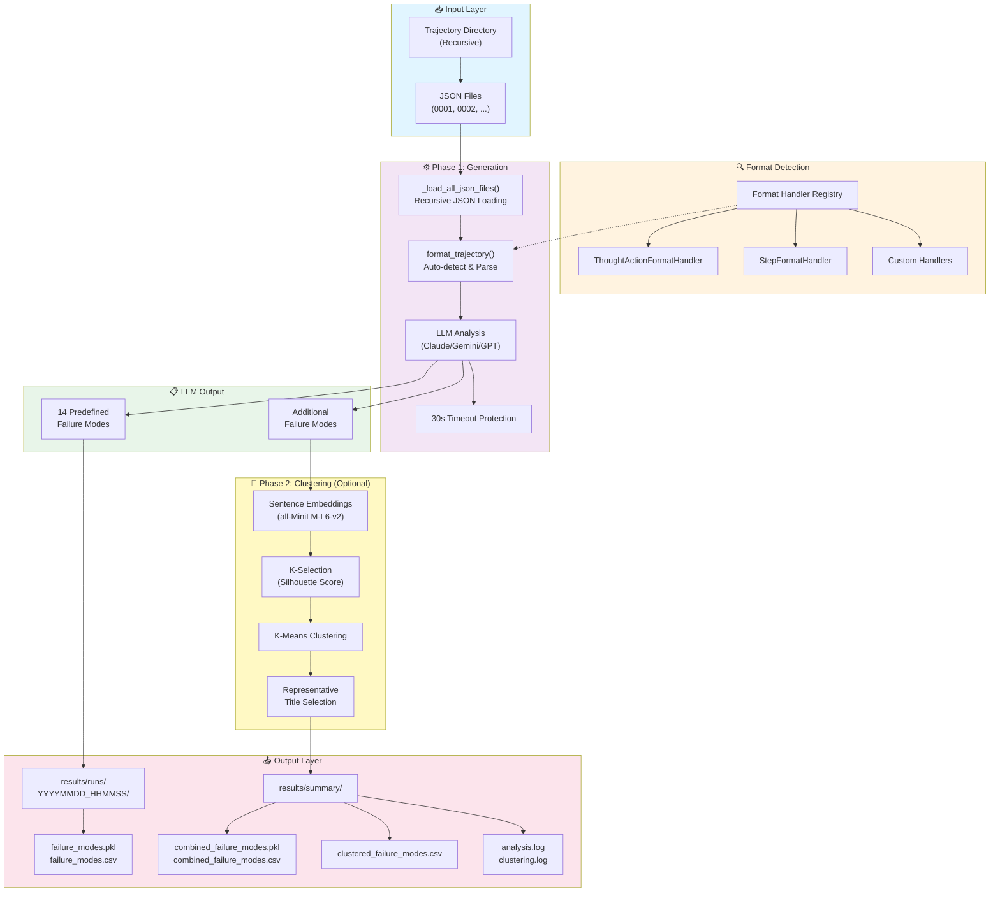

# Trajectory Failure Mode Analysis

Automatically analyze LLM agent trajectories to identify and categorize failure modes using LLM-based analysis.

## 🏗️ System Architecture



### Pipeline Flow

1. **Input Layer**: Recursively loads all JSON trajectory files from the specified directory
2. **Format Detection**: Auto-detects trajectory format using registered handlers
3. **Phase 1 - Generation**:
   - Parses trajectories into standardized format
   - Sends to LLM for failure mode analysis
   - Applies 30-second timeout protection
   - Identifies both predefined and custom failure modes
4. **Phase 2 - Clustering** (Optional):
   - Generates embeddings for custom failure modes
   - Auto-selects optimal number of clusters
   - Groups similar failures together
   - Selects representative titles for each cluster
5. **Output Layer**:
   - Saves individual run results with timestamps
   - Creates combined summary across all runs
   - Generates clustered results with representative titles
   - Maintains detailed log files for auditing

## 🚀 Quick Start

### Installation

```bash
# Install base dependencies
uv sync

# Optional: Install clustering dependencies
uv sync --group trajectory-analysis
```

### Basic Usage

```bash
# Analyze trajectories (default: Claude via LiteLLM)
uv run python src/trajectory_analysis/failure_mode/analyze_trajectories.py \
    --path src/trajectory_analysis/failure_mode/sample_trajectories/mistral-large

# With verbose logging
uv run python src/trajectory_analysis/failure_mode/analyze_trajectories.py \
    --path src/trajectory_analysis/failure_mode/sample_trajectories/mistral-large \
    --verbose

# With clustering enabled
uv run python src/trajectory_analysis/failure_mode/analyze_trajectories.py \
    --path src/trajectory_analysis/failure_mode/sample_trajectories/mistral-large \
    --cluster
```

### Command-Line Options

| Option | Short | Default | Description |
|--------|-------|---------|-------------|
| `--path` | `-p` | `./sample_trajectories` | Input directory with trajectory JSON files |
| `--output` | `-o` | `./results` | Output directory for results |
| `--model-id` | `-m` | `litellm_proxy/aws/claude-sonnet-4-6` | LLM model for analysis |
| `--temperature` | `-t` | `0.0` | LLM temperature (0.0=deterministic) |
| `--cluster` | | `False` | Enable clustering after analysis |
| `--cluster-only` | | `False` | Skip analysis, only combine & cluster existing runs |
| `--num-clusters` | `-k` | `auto` | Number of clusters (auto-selects optimal) |
| `--verbose` | `-v` | `False` | Enable detailed logging + save log file |

## 🎯 Key Features

- **14 Predefined Failure Modes**: Automatically detects common agent failures
- **Custom Failure Discovery**: LLM identifies additional failure patterns
- **Intelligent Clustering**: Groups similar failures using embeddings
- **Multi-Format Support**: Handles different trajectory JSON structures (auto-detected)
- **Organized Output**: Timestamped runs with centralized summary
- **Timeout Protection**: 30-second timeout prevents hanging
- **Verbose Logging**: Optional detailed logging with timestamped log files

## 📊 Input Format

The system auto-detects and supports multiple trajectory formats:

**Format 1: Old Format (task_description/agent_name/response)**
```json
{
  "text": "Download sensor data",
  "trajectory": [
    {
      "task_description": "Connecting to database",
      "agent_name": "IoTAgent",
      "response": "Successfully connected"
    }
  ],
  "final_answer": "Data downloaded"
}
```

**Format 2: New Format (thought/action/observation)**
```json
{
  "task": "Analyze vibration data",
  "trajectory": [
    {
      "thought": "Need to retrieve sensor data",
      "action": "query_iot_database",
      "observation": "Retrieved 1000 data points"
    }
  ],
  "result": "Bearing fault detected"
}
```

## 📈 Output Structure

```
results/
├── runs/                              # Individual run results
│   ├── run_20260414_140523/           # Timestamped run folder
│   │   ├── failure_modes.csv          # Analysis results (CSV)
│   │   ├── failure_modes.pkl          # Analysis results (Pickle)
│   │   └── analysis.log               # Detailed log (with --verbose)
│   └── run_20260414_153012/           # Another run
│       ├── failure_modes.csv
│       ├── failure_modes.pkl
│       └── analysis.log               # Detailed log (with --verbose)
└── summary/                           # Aggregated results (created with --cluster)
    ├── combined_failure_modes.csv     # All runs combined
    ├── combined_failure_modes.pkl
    ├── additional_fm.csv              # Additional failures extracted
    ├── additional_fm_clustered.csv    # Clustered results
    └── clustering.log                 # Clustering log (with --verbose --cluster-only)
```

### Output Files

**Individual Run (`results/runs/{timestamp}/`)**
- `failure_modes.pkl`: Pickle file with DataFrame
- `failure_modes.csv`: CSV file with same data

**CSV Column Reference**:

| Column | Type | Description | Example |
|--------|------|-------------|---------|
| `model_id` | string | LLM model used for analysis | `litellm_proxy/claude-sonnet-4-6` |
| `trajectory_path` | string | Full path to trajectory file | `src/trajectory_analysis/failure_mode/trajectories/mistral-large/0003` |
| `format_handler` | string | JSON format handler used to parse trajectory | `ThoughtActionFormatHandler` |
| `counter` | integer | Sequential row number (1-based) | `1`, `2`, `3` |
| `ut_id` | string | Trajectory identifier (filename) | `0003`, `0004` |
| `addi_fm_cnt` | integer | Count of additional failure modes discovered | `0`, `1`, `2` |
| `addi_fm_list` | list[dict] | List of additional failure modes with `title` and `description` | `[{'title': 'Artifact Contamination', 'description': '...'}]` |
| `1.1 Disobey Task Specification` | boolean | Predefined failure mode flag | `True`, `False` |
| `1.2 Disobey Role Specification` | boolean | Predefined failure mode flag | `True`, `False` |
| `1.3 Step Repetition` | boolean | Predefined failure mode flag | `True`, `False` |
| `1.4 Loss of Conversation History` | boolean | Predefined failure mode flag | `True`, `False` |
| `1.5 Unaware of Termination Conditions` | boolean | Predefined failure mode flag | `True`, `False` |
| `2.1 Conversation Reset` | boolean | Predefined failure mode flag | `True`, `False` |
| `2.2 Fail to Ask for Clarification` | boolean | Predefined failure mode flag | `True`, `False` |
| `2.3 Task Derailment` | boolean | Predefined failure mode flag | `True`, `False` |
| `2.4 Information Withholding` | boolean | Predefined failure mode flag | `True`, `False` |
| `2.5 Ignored Other Agent's Input` | boolean | Predefined failure mode flag | `True`, `False` |
| `2.6 Action-Reasoning Mismatch` | boolean | Predefined failure mode flag | `True`, `False` |
| `3.1 Premature Termination` | boolean | Predefined failure mode flag | `True`, `False` |
| `3.2 No or Incorrect Verification` | boolean | Predefined failure mode flag | `True`, `False` |
| `3.3 Weak Verification` | boolean | Predefined failure mode flag | `True`, `False` |

**Notes**:
- **Additional Failure Modes**: Beyond the 14 predefined categories, the LLM can identify novel failure patterns. These are stored in `addi_fm_list` with custom titles and descriptions.
- **Format Handler**: Indicates which parser was used (e.g., `ThoughtActionFormatHandler` for thought/action/observation format, `TaskDescriptionFormatHandler` for task_description/agent_name/response format).

**Summary (`results/summary/` - created with --cluster)**
- `combined_failure_modes.{pkl,csv}`: All runs combined (includes `run_id` column from folder names)
- `additional_fm.csv`: Additional failures from all runs (exploded from `addi_fm_list`)
- `additional_fm_clustered.csv`: Clustered additional failures with representative labels

**Clustered Results CSV Column Reference** (`additional_fm_clustered.csv`):

| Column | Type | Description | Example |
|--------|------|-------------|---------|
| `cluster` | integer | Cluster ID assigned by K-means clustering | `0`, `1`, `2` |
| `failure mode` | string | Representative title for the cluster (closest to centroid) | `"Data Quality Issues"`, `"API Timeout"` |
| `trajectory_path` | string | Full path to source trajectory file | `src/trajectory_analysis/failure_mode/trajectories/mistral-large/0003` |
| `title` | string | Original failure mode title from LLM analysis | `"Data Validation Error"`, `"Missing Field"` |
| `description` | string | Detailed description of the failure mode | `"The agent failed to validate input data..."` |

**Notes**:
- **Clustering**: Uses sentence embeddings (default: `all-MiniLM-L6-v2`) and K-means to group similar failure modes
- **Representative Title**: The `failure mode` column shows the title closest to the cluster centroid, representing all failures in that cluster
- **Auto K-selection**: If `--num-clusters` not specified, uses silhouette score to find optimal number of clusters (range: 2-7)
- **Trajectory Traceability**: `trajectory_path` allows you to trace each failure back to its source trajectory

### Logging Behavior

**Log files are ALWAYS created** for audit trail purposes, regardless of the `--verbose` flag:

**With `--verbose` flag:**
- ✅ Logs displayed on screen (real-time monitoring)
- ✅ Logs saved to file (permanent record)

**Without `--verbose` flag:**
- ❌ No logs on screen (quiet mode)
- ✅ Logs saved to file (permanent record)

```bash
# Verbose mode: See logs on screen AND in file
uv run python -m src.trajectory_analysis.failure_mode.analyze_trajectories \
    --path trajectories/mistral-large \
    --verbose

# Quiet mode: Logs only in file (clean console output)
uv run python -m src.trajectory_analysis.failure_mode.analyze_trajectories \
    --path trajectories/mistral-large

# Clustering with verbose
uv run python -m src.trajectory_analysis.failure_mode.analyze_trajectories \
    --cluster-only \
    --verbose
```

**Log File Locations**:
- **Analysis logs**: `results/runs/YYYYMMDD_HHMMSS/analysis.log`
- **Clustering logs**: `results/summary/clustering.log`

**Log Contents**:
- Timestamp for each operation
- File loading progress
- LLM analysis details
- Format handler detection
- Clustering progress (embeddings, K-selection, representative titles)
- Error messages and warnings

**Example Log Entry**:
```
2026-04-14 19:51:09,686 - INFO - 📄 Loading: src/trajectory_analysis/failure_mode/trajectories/mistral-large/0003
2026-04-14 19:51:09,687 - INFO -    🔧 Using handler: ThoughtActionFormatHandler
2026-04-14 19:51:10,234 - INFO -    ✅ Analysis complete
```

**Benefits**:
- ✅ **Always auditable**: Log files created regardless of verbose flag
- ✅ **Flexible**: Choose between quiet or verbose console output
- ✅ **Organized**: Each run has its own log file co-located with results
- ✅ **Traceable**: Easy to identify which log belongs to which run
- ✅ **Clean**: Quiet mode keeps console output minimal for production use

## 🔍 Detected Failure Modes

### Task Execution Issues (1.x)
- **1.1** Disobey Task Specification
- **1.2** Disobey Role Specification
- **1.3** Step Repetition
- **1.4** Loss of Conversation History
- **1.5** Unaware of Termination Conditions

### Communication Issues (2.x)
- **2.1** Conversation Reset
- **2.2** Fail to Ask for Clarification
- **2.3** Task Derailment
- **2.4** Information Withholding
- **2.5** Ignored Other Agent's Input
- **2.6** Action-Reasoning Mismatch

### Verification Issues (3.x)
- **3.1** Premature Termination
- **3.2** No or Incorrect Verification
- **3.3** Weak Verification

## ⚙️ Configuration

### LiteLLM Proxy (Recommended)

```bash
export LITELLM_API_KEY="your-api-key"
export LITELLM_BASE_URL="https://your-proxy-url"

# Use with model ID
--model-id litellm_proxy/aws/claude-sonnet-4-6
--model-id litellm_proxy/gcp/gemini-2.0-flash-exp
```

### WatsonX

```bash
export WATSONX_APIKEY="your-api-key"
export WATSONX_URL="https://your-watsonx-url"
export WATSONX_PROJECT_ID="your-project-id"

# Use with model ID
--model-id watsonx/meta-llama/llama-3-3-70b-instruct
```

## 🧪 Testing

```bash
# Run all tests
uv run pytest src/trajectory_analysis/failure_mode/tests/

# Run with coverage
uv run pytest --cov=src/trajectory_analysis/failure_mode/core
```

## 🔧 Diagnostic Tools

Three diagnostic scripts are available to help troubleshoot and verify your setup:

### 1. Test All Available Models
Tests all LiteLLM proxy models and provides a summary report (18/19 models typically working).

```bash
uv run python src/trajectory_analysis/failure_mode/diagnostics/test_all_litellm_models.py
```

**Output**: Summary of working/failed models by provider (Claude, Gemini, GPT)

### 2. Test Specific Model Connection
Verifies that a specific LLM model is accessible and responding correctly.

```bash
uv run python src/trajectory_analysis/failure_mode/diagnostics/test_llm_model_connection.py \
    --model-id litellm_proxy/aws/claude-sonnet-4-6
```

**Use cases**:
- Verify model credentials before running analysis
- Test timeout behavior
- Debug connection issues

### 3. Verify Trajectory Format
Tests trajectory JSON format detection and parsing to ensure compatibility.

```bash
# Basic verification
uv run python src/trajectory_analysis/failure_mode/diagnostics/verify_trajectory_import.py \
    src/trajectory_analysis/failure_mode/trajectories/mistral-large/0001

# Show what gets passed to LLM
uv run python src/trajectory_analysis/failure_mode/diagnostics/verify_trajectory_import.py \
    src/trajectory_analysis/failure_mode/trajectories/mistral-large/0001 \
    --show-prompt
```

**Use cases**:
- Verify new trajectory formats are supported
- Debug format detection issues
- Preview LLM prompt structure

## 📁 Project Structure

```
failure_mode/
├── analyze_trajectories.py          # Main CLI entry point
├── core/                             # Core pipeline modules
│   ├── generator.py                  # LLM-based trajectory analysis
│   ├── reducer.py                    # Clustering and categorization
│   ├── pipeline.py                   # High-level orchestration
│   ├── utils.py                      # LLM calls and JSON parsing
│   ├── prompts.py                    # System prompts for LLM
│   ├── format_handlers.py            # Multi-format support
│   └── timeout_wrapper.py            # Timeout protection
├── diagnostics/                      # Diagnostic utilities
├── tests/                            # Test suite
├── sample_trajectories/              # Example data
└── results/                          # Output (generated)
    ├── runs/                         # Individual run results
    └── summary/                      # Combined/clustered results
```

## 💡 Usage Examples

### Example 1: Simple Analysis
```bash
uv run python src/trajectory_analysis/failure_mode/analyze_trajectories.py \
    --path ./trajectories/mistral-large

# Output: results/runs/20260414_140523/failure_modes.{pkl,csv}
```

### Example 2: With Clustering
```bash
uv run python src/trajectory_analysis/failure_mode/analyze_trajectories.py \
    --path ./trajectories/mistral-large \
    --cluster

# Output:
#   results/runs/20260414_140523/failure_modes.{pkl,csv}
#   results/summary/combined_failure_modes.{pkl,csv}
#   results/summary/additional_fm.csv
#   results/summary/additional_fm_clustered.csv
```

### Example 3: Multiple Runs, Then Cluster
```bash
# Run 1 - analyze mistral-large
uv run python src/trajectory_analysis/failure_mode/analyze_trajectories.py \
    --path ./trajectories/mistral-large

# Run 2 - analyze gpt4
uv run python src/trajectory_analysis/failure_mode/analyze_trajectories.py \
    --path ./trajectories/gpt4

# Run 3 - analyze claude
uv run python src/trajectory_analysis/failure_mode/analyze_trajectories.py \
    --path ./trajectories/claude

# Now cluster all 3 runs together (no new analysis)
uv run python src/trajectory_analysis/failure_mode/analyze_trajectories.py \
    --cluster-only

# Summary folder now contains combined results from all 3 runs
```

### Example 4: Cluster-Only Mode
```bash
# You already have runs in results/runs/
# Just want to re-cluster with different parameters

uv run python src/trajectory_analysis/failure_mode/analyze_trajectories.py \
    --cluster-only \
    --num-clusters 5

# Or with different embedding model
uv run python src/trajectory_analysis/failure_mode/analyze_trajectories.py \
    --cluster-only \
    --embedding-model all-mpnet-base-v2
```

### Example 5: Load and Analyze Results
```python
import pandas as pd

# Load individual run
df = pd.read_pickle('results/runs/20260414_140523/failure_modes.pkl')
print(df.head())

# Load combined results
combined = pd.read_pickle('results/summary/combined_failure_modes.pkl')
print(f"Total trajectories: {len(combined)}")

# Filter by failure mode
weak_verification = combined[combined['3.3 Weak Verification'] == True]
print(f"Weak verification: {len(weak_verification)} trajectories")

# Load clustered results
clusters = pd.read_csv('results/summary/additional_fm_clustered.csv')
print(clusters.groupby('cluster').size())
```

## 🐛 Troubleshooting

**"Model not available"**
- Run `test_all_litellm_models.py` to see available models
- Check API credentials

**"Timeout after 30 seconds"**
- Use a faster model or increase timeout in code

**"Invalid trajectory format"**
- Use `verify_trajectory_import.py` to check JSON structure

**"No additional failure modes found"**
- Normal if trajectories only have predefined failures
- Try with `--cluster` flag

## 📚 Additional Documentation

- **tests/README.md**: Testing strategy and test documentation
- **diagnostics/README.md**: Diagnostic tools guide

## 🤝 Contributing

1. Add tests for new features
2. Update README for new functionality
3. Follow existing code style (type hints, docstrings)
4. Run test suite before submitting

## 📄 License

See LICENSE file in repository root.
